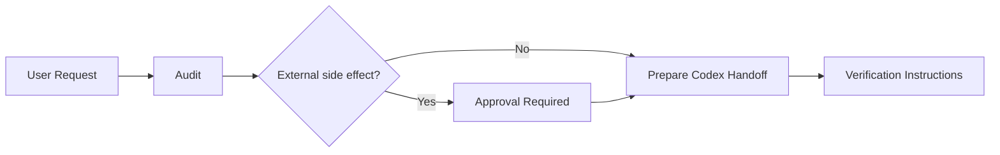

# MARCUS Operator Demo Worker

A deliberately small Cloudflare Worker that demonstrates one slice of the MARCUS execution model: **inspect the requested work, classify risk, prepare an agent handoff, and keep external side effects approval-gated.**

This is a demonstration project rather than the full MARCUS runtime.

## What it demonstrates

- a lightweight audit step before agent execution
- deterministic risk classification for obviously external actions
- structured Codex handoff prompts
- explicit approval boundaries
- health/readiness endpoints
- deployable Cloudflare Worker packaging
- automated tests and dry-run deployment checks

## Flow



## Endpoints

- `GET /demo` — describes the demo
- `GET /health` — runtime health
- `GET /readiness` — capability/readiness report
- `POST /audit` — audits a requested task and composes a handoff
- `POST /codex/start` — creates a demonstration Codex handoff session

## Local verification

```bash
npm install
npm test
npm run check
```

`npm run check` uses Wrangler's dry-run deploy path; it does not publish the Worker.

## Relationship to MARCUS

The full public MARCUS project is available at:

https://github.com/markgromer/marcus

This worker exists as a small, inspectable example of the broader principle: **AI execution should sit behind explicit state, constraints, approvals, and verification rather than being given unrestricted authority.**

## License

No open-source license is granted for this demo unless a license file is added later. GitHub users may inspect and fork the repository under GitHub's platform terms, but no additional reuse rights are granted here.
